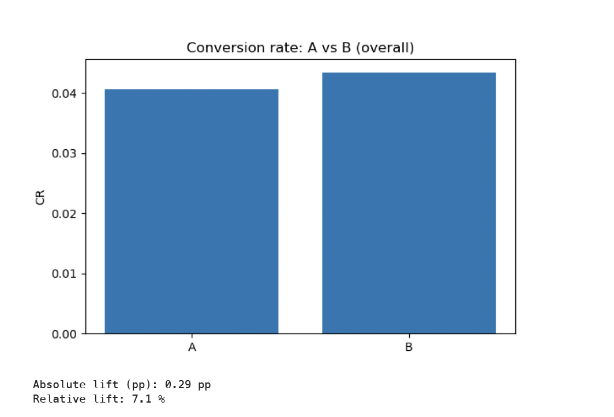
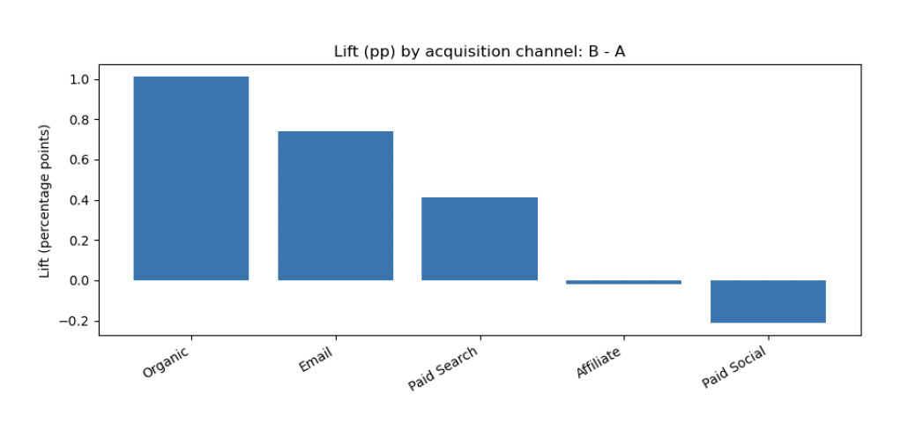
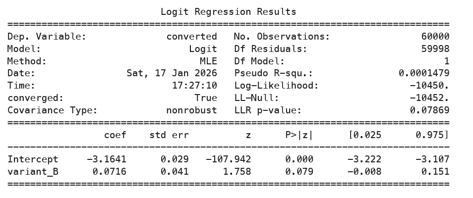
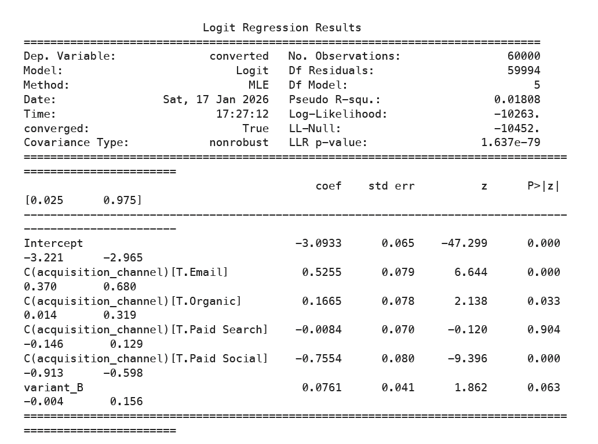
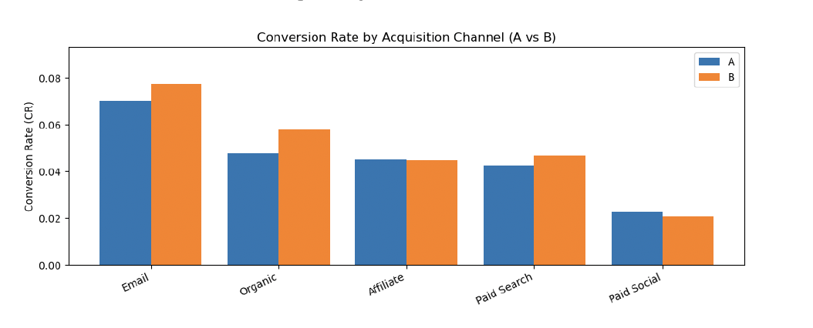

# A/B Test: Landing Page Redesign + Logistic Regression (Python)
by Konrad Kuleta

**Scenario:** E-commerce landing page test for new customers.  
**Objective:** Evaluate whether the new landing page (**Variant B**) increases purchase probability (**conversion**) versus **Variant A**.

This case study shows an end-to-end A/B test workflow in Python: basic sanity checks, conversion comparison, and a model-based estimate (logistic regression) with and without controlling for acquisition channel.

---

## What’s inside

### Key outputs (plots)
**Overall conversion (A vs B)**

**Lift by channel (B − A, percentage points)**

**Logistic regression — Model 1 (unadjusted)**

**Logistic regression — Model 2 (channel-adjusted)**

**Conversion rate by channel (A vs B)**

## Repository structure

├── assets/
│ ├── 01_cr_overall_A_vs_B.png
│ ├── 02_lift_pp_by_channel_B_minus_A.png
│ ├── 03_logit_model1_unadjusted_summary.png
│ ├── 04_logit_model2_channel_adjusted_summary.png
│ └── 05_cr_by_channel_A_vs_B.png
├── data/
│ └── ab_test_data.csv
├── notebooks/
│ ├── 00_data_generation.ipynb
│ └── 01_ab_test_analysis.ipynb
└── reports/
├── ab_test_landing_page.html
└── ab_test_landing_page.pdf

## Method overview (high level)

1. **Data & setup**
   - Synthetic A/B test dataset with user-level rows: `user_id`, `date`, `acquisition_channel`, `variant`, `converted`.

2. **Sanity checks**
   - Sample ratio mismatch (SRM) check to confirm the A/B split is close to 50/50.

3. **Descriptive results**
   - Overall conversion rate for A vs B.
   - Conversion rate split by acquisition channel.

4. **Model-based estimate (logistic regression)**
   - **Model 1 (unadjusted):** `converted ~ variant_B`  
     Measures the raw difference between variants.
   - **Model 2 (channel-adjusted):** `converted ~ variant_B + C(acquisition_channel)`  
     Estimates the variant effect while controlling for traffic mix (differences in channel baseline conversion).

---

## Summary

### Key findings
- Variant **B** shows a small uplift vs **A** in overall conversion.
- Conversion rates differ strongly by **acquisition channel** (traffic mix matters).
- The estimated Variant B effect is similar in the unadjusted and channel-adjusted models (consistent direction), but the evidence is not strong enough to treat the uplift as “proven” with high confidence.

### Recommendations
- If launching Variant B, prefer a **cautious rollout** (e.g., staged deployment / monitoring).
- Focus follow-up tests on the **highest-impact channels** (highest volume or business value) to get a clearer decision faster.

### Limitations
- **Synthetic dataset:** patterns are simulated and may not reflect real tracking noise, attribution issues, or user behavior complexity.
- **Single primary metric:** conversion only (no revenue/AOV, etc.).
- **Channel splits are descriptive:** per-channel differences are shown for intuition.

